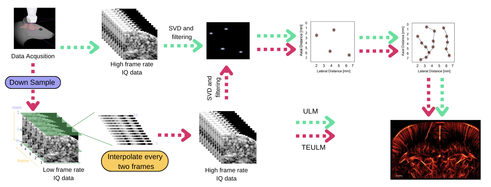
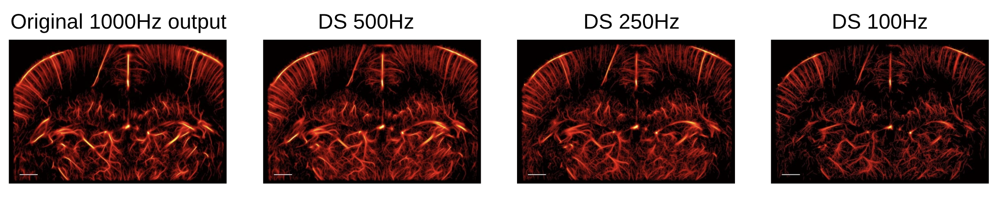
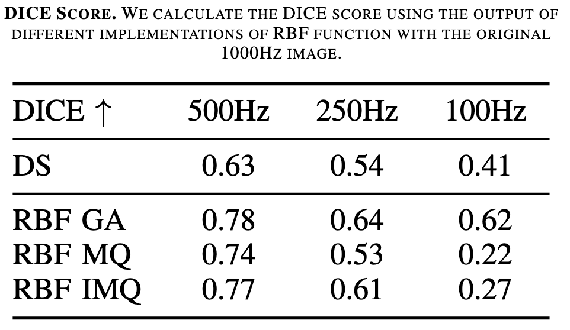
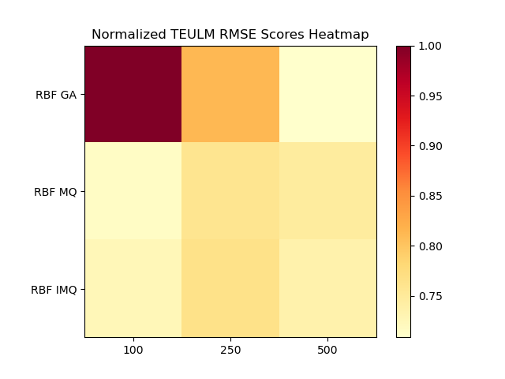
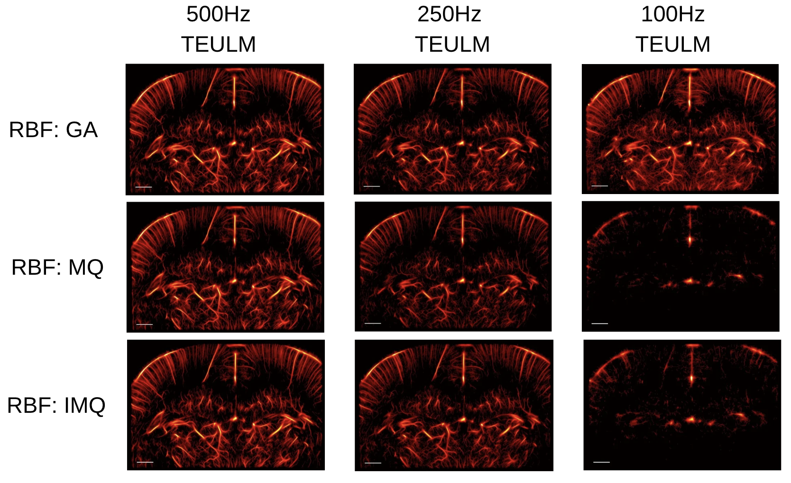

## Time Efficient Ultrasound Localization Microscopy (TEULM)

for Shanghaitech CS270 Project4


Run the project:
---
- Data (.mat) should be download into ```TEULM\PALA_data_InVivoRatBrain\IQ```
- Run the PALA_SetUpPaths.m to check the packages.
- Run the ```TEULM\PALA_InVivoULM_example.m``` to gain the ULM output.
- For downsampling, run ```TEULM\PALA_TEULM_DS.m```
- For interpolation according to the DS data, run ```TEULM\PALA_TEULM\PALA_TEULM_Interpolation.m```
    - you cam modify ```process_files(Ori_low_datas_100, 100, save_dir_1, epsilon, 'MQ', 11);```to change input(data, type(Hz), save directory, RBF epsilon, RBF funxtion, interpolation num[add the original and final frames])
- Run the metrics: (output results are ready in ```TEULM\PALA_TEULM\RESULT```) ```TEULM\PALA_TEULM\metrics_dice.py``` and ```TEULM\PALA_TEULM\metrics_rmse.py```

Our pipeline
---



Our downsample results
---


Our Metrics(DICE and RMSE)
---



Comparision Results of RBF functions
---
